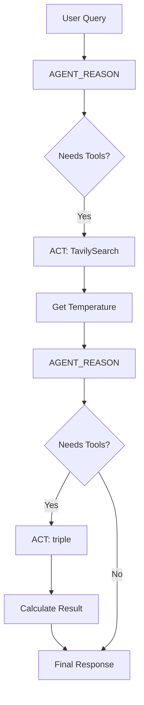

# LangGraph ReAct Agent - Code Flow Documentation

## Overview
This document explains how the ReAct agent processes queries using LangGraph, from user input to final output.

## 1. Initialization Phase

### Environment Setup
1. **Load Environment Variables**
   - `.env` file is loaded using `python-dotenv`
   - Contains API keys for Gemini and Tavily

### Tool Configuration (react.py)
1. **Define Available Tools**
   ```python
   @tool
   def triple(num: float) -> float
   ```
   - Custom tool for tripling numbers
   - TavilySearch tool for web searches

2. **LLM Configuration**
   ```python
   llm = ChatGoogleGenerativeAI(model="gemini-2.5-flash")
   ```
   - Sets up Gemini model
   - Binds tools to the model

## 2. Graph Structure (main.py)

### Node Definition
1. **Agent Reasoning Node (AGENT_REASON)**
   - Processes user input
   - Makes decisions about tool usage
   - Generates responses

2. **Action Node (ACT)**
   - Executes tools when needed
   - Returns tool results to reasoning node

### Edge Configuration
```
User Input → AGENT_REASON → should_continue → ACT → AGENT_REASON → END
```

## 3. Message Processing Flow

### Step 1: User Input
1. User provides a query:
   ```python
   "What is the temperature in Tokyo? List it and then triple it"
   ```
2. Query is wrapped in `HumanMessage`
3. Added to initial message state

### Step 2: Agent Reasoning (nodes.py)
1. **System Message Applied**
   - Instructions for multi-step reasoning
   - Tool usage guidelines
   - Response formatting requirements

2. **LLM Processing**
   - Analyzes user query
   - Decides on tool usage
   - Plans multi-step operations

### Step 3: Flow Control
1. **should_continue Function**
   - Checks if tools are needed
   - Decides between:
     * Continue to ACT
     * End processing (END)

### Step 4: Tool Execution
1. **If tools needed:**
   - Tool node receives request
   - Executes appropriate tool
   - Returns results to agent

2. **If no tools needed:**
   - Proceeds to final response
   - Ends processing

## 4. Example Flow: Temperature Query

### Initial Query Processing


1. **First Pass (Temperature Search)**
   - Agent recognizes need for temperature data
   - Uses TavilySearch tool
   - Gets current temperature

2. **Second Pass (Calculation)**
   - Agent extracts temperature value
   - Uses triple tool
   - Formats final response

### Response Generation
1. **Combines Results**
   - Original temperature
   - Tripled value
   - Clear explanation

2. **Returns to User**
   - Formatted response
   - Shows work/reasoning

## 5. State Management

### MessagesState
- Maintains conversation history
- Tracks tool usage
- Preserves context between steps

### StateGraph
- Manages node transitions
- Handles conditional routing
- Maintains processing state

## 6. Error Handling

### Tool Errors
1. **Search Failures**
   - Network issues
   - API limits
   - Invalid results

2. **Calculation Errors**
   - Invalid number formats
   - Out of range values

### LLM Errors
- Token limits
- API failures
- Invalid responses

## 7. Visualization

### Graph Visualization
- Generated as flow.png
- Shows node connections
- Helps debug flow issues

## Debug Tips
1. Check the flow.png for graph structure
2. Monitor tool execution in logs
3. Verify state transitions
4. Validate tool inputs/outputs
